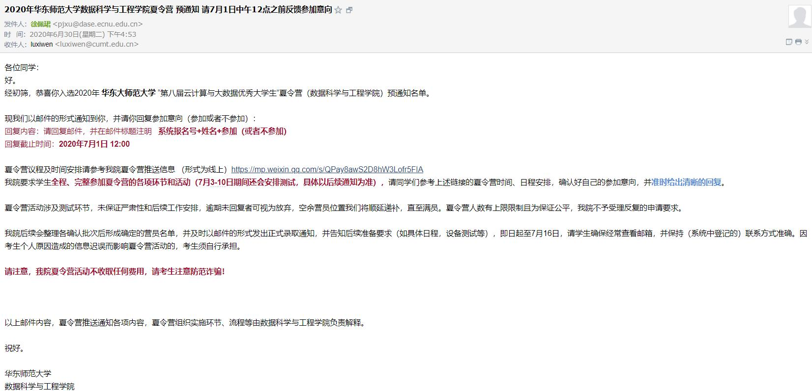

> 船到桥头自然直，做好实力积累。

>这份README没有什么想分享的，纯粹如项目名一样，记录一些时间节点和里程碑。后来者，当根据自身情况，书写自己的故事。一切都是以实力为内核下，缘分的试探，

# 前言

夏令营我的情况还算可以，因而预推免基本没有再申请任何学校（仅再次尝试了同济），夏令营结果基本是我的最终结果。

# 我的夏令营申请情况记录

| 序号   | 学校名称     | 学院         | 结果（未入营/入营/候补/优营）       |
|------|----------|------------|------------|
| 1    | 南开大学     | 计算机科学      | 未入营        |
| 2    | 中国科学技术大学 | 大数据        | 未入营 |
| 3    | 复旦大学     | 工程与应用技术研究院 | 候补转正（最终去向）    |
| 4    | 南京大学     | 计算机学院（开放日） | 未入营        |
| 5    | 南京大学     | 软件学院       | 未入营        |
| 6    | 华东师范大学   | 数据科学与工程    | 优营        |
| 7    | 武汉大学     | 经济管理学院     | 未入营   |
| 8    | 西安交通大学   | 计算机        | 未入营     |
| 9    | 西安交通大学   | 管理学院       | 未入营        |
| 10   | 厦门大学     | 信息学院       | 未入营     |
| 11   | 中山大学     | 数据科学与工程学院  | 未入营  |
| 12   | 同济大学     | 电子信息与工程    | 未入营        |
| 13   | 浙江大学     | 计算机科学与技术学院 | 入营（直博）        |
| 14   | 上海交通大学   | 电子信息学院     |            |
|      | 上海交通大学   | 软件学院       | 已申报        |
| 15   | 东南大学     | 计算机科学与技术   | 优营           |
| 16   | 国防科技大学   |            |            |
| 17   | 上海科技大学   | 信息         |   未入营     |
| 18   | 哈工大本部    |            |            |
| 19   | 中科院软件所   |            |   未入营  |

# 第一封夏令营入营邮件

是华东师大给我发了第一封入营邮件，当时正在去理学院的路上，很激动。因而在仓库里，唯一留了一份他的文件夹，介绍一下华东师大数据学院 :blush:  。

# 第一个面试
最先开始面试的是复旦，但是第一次初出茅庐还是稚嫩了，最后只有候补，不过最后还是转正了。:)

# 第一个优营
华东师大数据科学与工程学院！给了我第一个优营！也就是自此后的面试，心态完全不一样了。

# 被老师电话联系

在面试东南时候，脑科学与智能科学技术研究院的老师，面试第二天直接电话联系我了，说我和他们的研究方向比较吻合，问我是否愿意去他们实验室就读。这是第一次面完试就接到老师电话！当时也很激动，东南稳了。心中曾在意的某南京人，遗憾，最后都没能选择南京。也许就是运。

在这里也给东南脑智院放上介绍PPT。

# 结束
10.12填系统，今年应该是最晚的一年了吧，没有什么太大波澜。直博复旦。准备在未来迎接新的挑战。