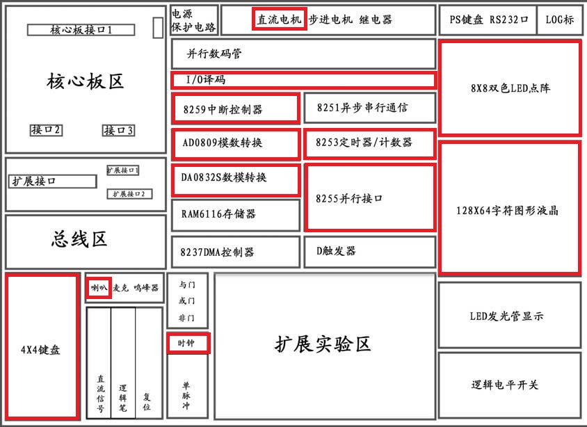
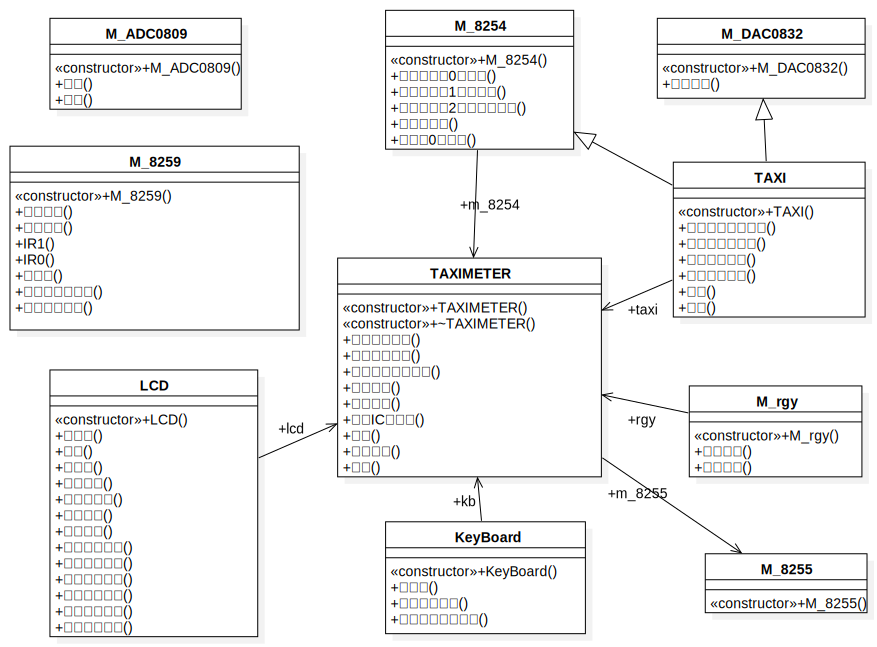

# 出租车计价器（C语言）

硬件课程设计总体上还是十分满意的，自己把中断的理论全部过了一遍，在实验中通过查询式实现了扩展8259的接口，再给点时间就能将整个计价器系统改为基于8259的方式了。整体的代码也独立实现了面向对象的编程思路，算是弥补了一点点暑假没有自己写魔兽世界的缺憾吧。

整个系统面向对象，在数据接口、类间通信之间还是做得有点差，为了方便起见使用`struct`全部`publilc`方式还是太low了。

关于报告，多次数模的经历还是起了很大的帮助，总体上自己看着还是十分满意的。

# 演示视频

最后的时候，找同学录了个演示视频，结果演示时候出现了“初值漂移”，系统还是不太完善。优酷地址：[https://v.youku.com/v_show/id_XNDQ3NTg3ODQwMA==.html?spm=a2h3j.8428770.3416059.1](https://v.youku.com/v_show/id_XNDQ3NTg3ODQwMA==.html?spm=a2h3j.8428770.3416059.1)

# 实现与展望（一点遗憾）

自认为已经做得非常好了，详细内容可以参看 `结课报告-终期报告` 。

报告里也写到了整个系统的不足与遗憾处，终端和语音播报思路与接口都有了，就差再多花点时间去整合。如果有同学感兴趣在我的计价器上进一步改进，非常欢迎 E-mail Me，一起交流。

# 文件说明

整个课程设计中，有参考借鉴了非常多的资料，考虑到我的Github主要作为个人的代码仓库，仅保留最核心的有产出的被展示的部分文件。

*TAXIMETER*

其中，TAXIMETER文件夹为程序的工程项目文件夹，自己编写的即 `TAXIMETER.h` 与 `main.cpp`。此外，`ApiExUsb.h` 与 `ApiExUsb.lib`均为实验仪库文件，Debug文件夹中 `ApiEx.dll` 为运行时链接库，有了这5个文件，即可以在高版本Visual C++中跑起项目。此外，若使用实验室VC6.0编写C++程序，适当调整.dll文件的位置即可。

*参考资料*

罗列了在个人编程中对自己启发比较大的4份文档，当然，微机课本也是反复参考了很多次。visio图芯片文档感谢 @李治国 提供参考。

*中期报告*

就是发挥想象力的报告，当时的唯一思路就是使劲向现实中计价器的功能靠拢，做的越多越像就好。当时还没想到点阵屏模仿空车牌，还是马老师提醒的好。

*结课报告*

内容少了点，不过排版上确实费了很多心力，数模经验在Word排版上起了很大的帮助。关于Dev代码复制进word保持代码高亮，参见[https://blog.csdn.net/weixin_42577438/article/details/102785626](https://blog.csdn.net/weixin_42577438/article/details/102785626)。果然经验在有些时候还是很有用的，回想起马老师指点吕宙时说到将图片编号a、b、c再在下面加图注，瞬间让我想到了之前读过的论文，这样编排图片紧凑，绝不多占一分空间。

*UML模型与图片* 

主要是结合在学的《软件工程》对整个系统进行面向对象分析，这个项目也算是自己从0编写的第一个面向对象的应用了，去年的程序设计综合实践终归抄书太多。

